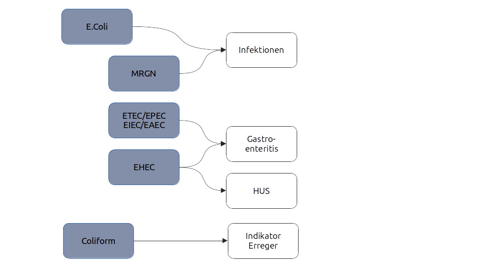

E.Coli: ein typischer Gastroenteritis-Erreger
========================================================
author: Jakob Schumacher
date: 25.01.2022
autosize: false
font-import: http://fonts.googleapis.com/css?family=Ubuntu
font-family: 'Ubuntu'

Jakob Schumacher
========================================================
- Hygienereferent im Gesundheitsamt Reinickendorf
- Zuvor: 
  - Robert Koch-Institut
  - Bundesministerium für Gesundheit 
  - Medizin (Krankenhaus, Gefängnis)

Überblick über Montag und Mittwoch
========================================================
Teil 1: Überblick über Gastroenteritis
Teil 2: E.Coli ausführlich
Teil 3: Erreger bearbeiten: Trello-Board 
Teil 4: Board durchgehen
Teil 5: Walk and Talk

Teil 1
========================================================
type: section
# Überblilck über Gastroenteritis Erreger 

Gastroenteritis-Erreger
========================================================
* Norovirus
* Rotavirus
* Salmonellen
* Campylobacter
* Shigellen
* E.Coli
* Yersiniose
* Listeriose
* Giardia
* Kryptosporidiose

Die wichtigsten Punkte bei Gastroenteritis-Erregern
========================================================
* Gestroenteritis-Erreger sind häufig
* Viele Ausbrüche
* Gefährlichster Erreger: EHEC/HUS

Der Darm
========================================================
* 4-5 Meter lang
* Wichtigste Aufgabe: Verdauung, Immunabwehr und ?
* Enthält 1-2 Kilogramm Bakterien (Mikrobiom)
* Das Mikrobiom spielt eine größere Rolle als bislang gedacht

Was muss man zu einem Erreger wissen
========================================================
1. Namen des Erregers und Krankheit
1. Epidemiologie
1. Vorkommen
1. Umweltresistenz
1. Übertragungswege
1. Zeiten
1. Labornachweise
1. Meldepflichten
1. Infektionsinterview-Fragen
1. Maßnahmen

Teil 2
========================================================
type:section
# E.Coli und seine Krankheiten

========================================================

Gastroenteritis-Symptome
========================================================
* Krankheitsgefühl
* Bauchschmerzen
* Durchfall
* Erbrechen
* Fieber
* Schmerzen
* Blut im Stuhl

Hämolytisch-Urämische Symptome (HUS)
========================================================
* Anämie (Blutarmut)
* Urämie (Nierenversagen)
* Thrombozytopenie (Blutung)
* Neurologische Symptome

Infektionen
========================================================
* Wundinfektion
* Harnwegsinfektionen
* Sepsis

E.Coli und die Toxine
========================================================
* E.Coli hat diverse Mechanismen/Toxine
* Manche Mechanismen schützen vor Antibiotika
* Manche Mechanismen verursachen eine besser Anheftung oder Eindringung in die Zelle
* Shigatoxin 2 (nur EHEC) verursacht ein HUS

Epidemiologie
========================================================
* Massive Inzidenzen in Ländern mit hygienisch niedrigen Standards
* Deutschland
  * ~10.000 E.Coli-Enteritis
  * ~1000 Ehec
  * ~100 HUS
* Kinder und Reiserückkehrer

Vorkommen
========================================================
* Lebt im Enddarm von allen Warmblütern
* Weltweit vertreten
* EHEC vor allem in Wiederkäuern: Rinder, Schafe, Ziegen

Umweltverhalten
========================================================
* E.Coli lebt im Darm von Tieren 
* Von dort auf das Fell und die Umgebung
* Vom Fell beim Schlachten aufs Fleisch
* Vom Fell auf die Hand
* Vom Darm auf die Felder
* Vom Darm ins Wasser 
* Vom Wasser aufs Feld

Wichtigste Übertragung auf Menschen
========================================================
* Kontaktinfektion (Schmierinfektion)
  * Übertragung über Hände (Streichelzoo)
  * Fäkal-Oral
* Lebensmittel
* Trinkwasser

Zeiten
========================================================
* Inkubationszeit: 2-10 Tage
* Ansteckungsfähige Zeit: Solange Symptome bestehen. Aber Dauerausscheidung möglich 

Labornachweise
========================================================
* Kultur
* PCR
* ELISA 
* Genomsequenzierung

E.Coli erscheint als folgende Meldung
========================================================
* HUS (Arzt)
* EHEC (Labor)
* E.Coli-Enteritis (Labor, §33, § 36, §42)
* Wasserkeim (TrinkWV)
* MRGN (Labor)
* Wundinfektionskeim (Fehlmeldung)

Maßnahmen EHEC
========================================================
* Informationsbeschaffung, Übermittlung, Informationsweitergabe (Lebensmittelaufsicht)
* Ausbruchsuntersuchung
* Aufklärung
  * Erreger
  * Küchenhygiene
  * Toilettenhygiene.
  * Händehygiene
  * Wäschehygiene
  * Lebensmittelhygiene auf Reisen
  * Streichelzoo
* Isolierung der erkrankten Person in einer Einrichtung
* Tätigkeitsverbot nach § 34
* Tätigkeitsverbot nach § 42

Infektionsinterview-Fragen
========================================================
* Welche Krankheitszeichen sind bei Ihnen aufgetreten?
* Wann hat die Erkrankung genau begonnen?
* Sind in Ihrem Umfeld weitere Personen erkrankt?
* Haben Sie eine Verbindung zu einer Kita oder ähnlichen Einrichtung?
* Haben Sie eine Verbindung zu einer Einrichtung, in der sehr viele Menschen untergebracht sind?
* Wohnen Sie mit jemand zusammen, der in eine Kita oder Schule geht oder dort arbeitet?
* Haben Sie beruflich mit Lebensmitteln zu tun?
* Waren Sie vor der Erkrankung im Ausland?
* Waren sie vor Erkrankungsbeginn im Kontakt mit Wiederkäuern? 

Teil 3 + 4
========================================================
type: section

<a href="https://trello.com/b/jhUvwVfx/hygko-67-68">Trello-Board<a>

